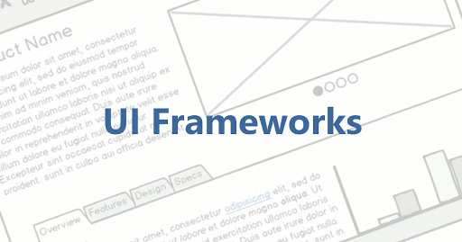

Whenever we are cutting diagrams, the most common thing is to restore the design diagrams one by one with HTML and CSS. In this process, we will find that a lot of redundant code that has been written. For example, for Button, a bunch of Button styles must be written wherever each page is used. Slowly, in order to speed up the development, a lot of copy and paste began, which resulted in dozens of very similar Button styles in the entire code. There are actually many components on the page that will be used many times like Button. At this time, we will think of extracting these common things and turning them into common components. In this way, when writing the page, as long as these common components are introduced, there is no need to repeat the content in the page. After continuous refinement, a UI library or UI framework is formed.

The benefits of using UI frameworks are also obvious. Standardization, transforming design standards into development standards. To improve development efficiency, developers only need to develop those parts that have no commonality in each page. It is easy to expand, uses a common framework, and the common content is gathered together. When we want to remodel or expand the product, we only need to upgrade the framework.

Semantic UI is a user-friendly and responsive front-end framework, with more than 3000 theme variables and more than 50 UI components, which can quickly build beautiful web pages. Semantic UI also integrates many third-party resource libraries, including React, Angular, Meteor, Ember, etc., which brings more convenience to developers. The biggest highlight of Semantic UI is "human-friendly HTML", which means that developers can use common language to visually display classification and naming, so they can read the code without any barriers.

Some common components
1. Buttons, icons, labels
Buttons can be set size, color, shape, etc.;
There are many categories of icons, and corresponding icons can be found in normal English;
Labels can be set with color, shape, fixed position, etc.;

2. list, item, card (image, content, header, description)
	List type: The items in the list are arranged vertically (vertical) by default, can be horizontal (horizontal), can have unordered dots (bulleted), can have ordinal numbers (ordered); lists can be nested and can be brought split line.
	The item can have an icon, and the item content can float around.
	Card related: can be grouped and nested in cards, content includes header, meta, description; extra content, bottom attached buttons, etc. can be added.

3. Grid and table
	The default number of semantic grids is 16, which can be directly embedded in column or row in the middle; column can be split proportionally.
	The table contains thead, tbody, and tfoot supports various styles (celled, stripped, warning, active, single line, selectable), and th/td can be distributed proportionally like a grid.

