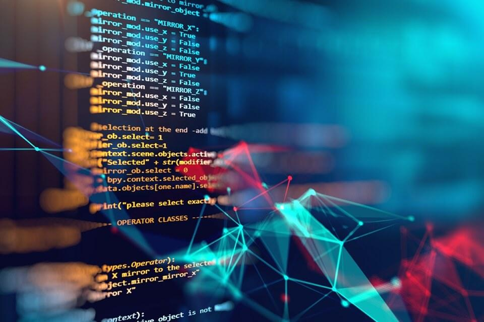

## My thoughts
Software Engineering can be regarded as one of the hardest courses for me this semester. But at the same time, the gains this course brought to me cannot compared with other courses. In this semester, I learned about the completeness of software development from project determination to project requirements analysis, to summary, detailed design, code design, and software testing after development, these are all the part of software development process. After learning the relevant methods and tools, I have the ability to manage the entire software development process. As to improve the quality and productivity of software, and finally realize the socialized production of software. Under the given cost and schedule, develop a software product that is modifiable, reliable, maintainable, portable, reusable and meets user needs.

## Development Environments
One concept I would like to share is development environment. The development environment is an application program used to provide a program development environment, which generally includes tools such as a code editor, a compiler, a debugger, and a graphical user interface. Integrated development software service suite with code writing function, analysis function, compilation function, debugging function, etc. All software or software suites with this feature can be called an integrated development environment. Such as Microsoft's Visual Studio series, Borland's C++ Builder, Delphi series and so on. This program can run independently or be used in conjunction with other programs. Over this semester, we have been using IntelliJ as our development environment. I gained a broad knowledge about the features that make developing more easily and efficient.

## Coding Standards
With the advancement of technology and the Internet, today we can easily engage in computer-related work. Basically, as long as we simply understand some computer programming-related content, we can write code that the computer understands and executes. Although the written code is executed by a computer, in more cases, the code we write is for humans to understand and read. Since the code is more for people to see, rather than just for the machine to run, then we need to pay attention to the standardization of the code when writing the code, because the code is not standardized will cause a lot of problems.
