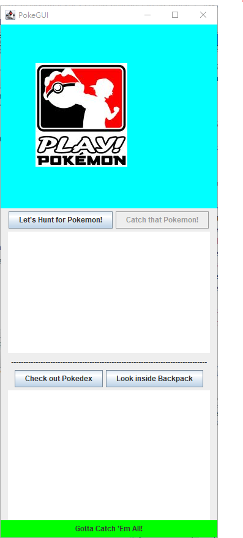
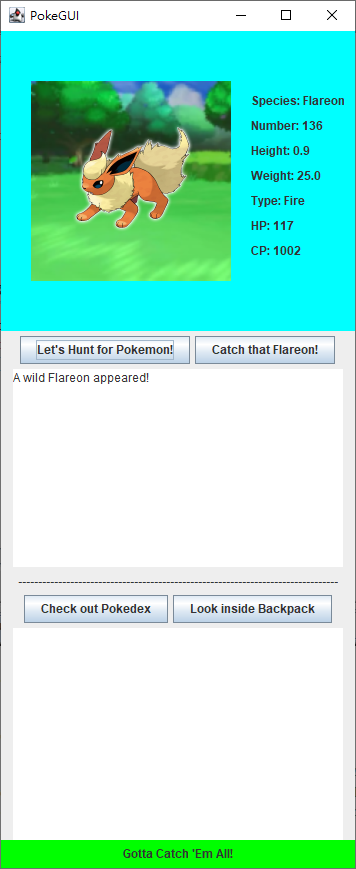
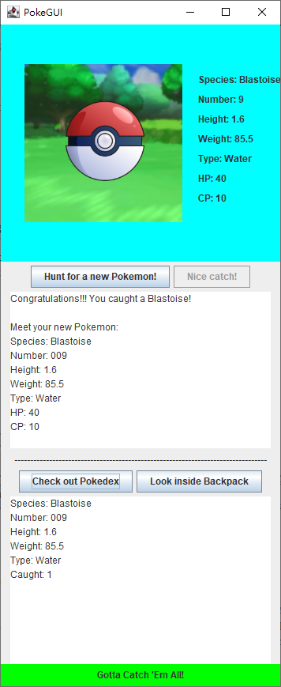

  
  
  
  

Pokemon GUI is a small Java GUI project I made with my group. This little interactive game allows user to explore different Pokemons. User can decide whether catch the pokemon or skip catching. When the user decided to catch the Pokemon, there's a chance that pokemon will escape. But if the user catch the Pokemon, the Pokemon will be added to their backpack and Pokedex.

