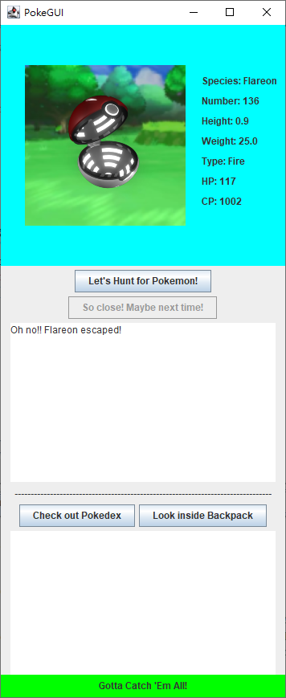

  
  
  
  

Pokemon GUI is the final project for ICS 211 I made with my group. This project implemented with graphical user interface (GUI) to create an interactive interface that allows users to do action on it. Before making the graphical user interface, we need to complete the assignments that is needed for this project. We create some files that includes Pokémon’s species, types, abilities, etc. These files implement with the Pokemon GUI will make this program more like a game.

This game allows users explore different Pokémon, in order to do so, users need to click the "Let's Hunt for Pokemon!" button to start the exploration. When a Pokemon was found, users can decide whether to catch the Pokemon by clicking the displayed button. If the users decided to catch the Pokemon, there's a chance that Pokemon will escape. But if the users catch the Pokemon, the Pokemon will be added to their backpack and Pokedex. The order of the Pokemon in the backpack will be sorted by the Pokedex number.

I enjoyed working with my groupmates on this project. This project not only gave me an opportunity to practice building the game with the skills I have learned, but also gave me a chance to fix my coding style. Having a good coding style is important, it makes the code easier to read, and fix errors. Overall, this game is very simple without any animation effects or player battle system, just some pictures, sentences, and buttons. But if we could add more features, it would make this game even better.
