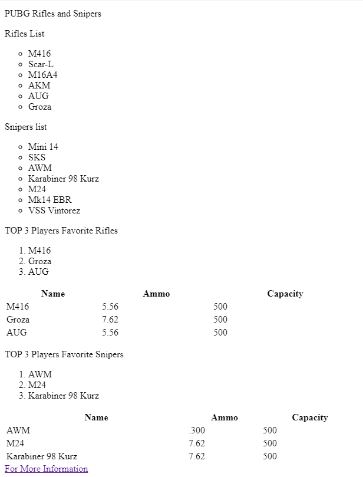
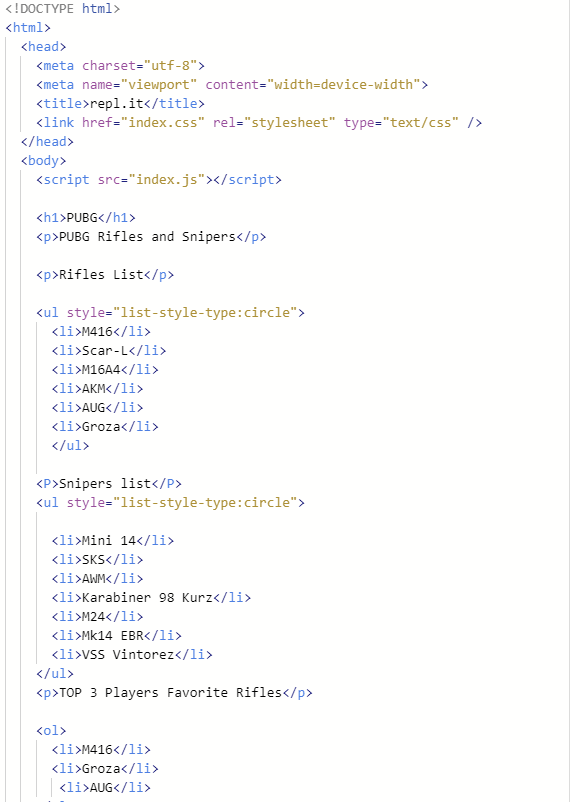
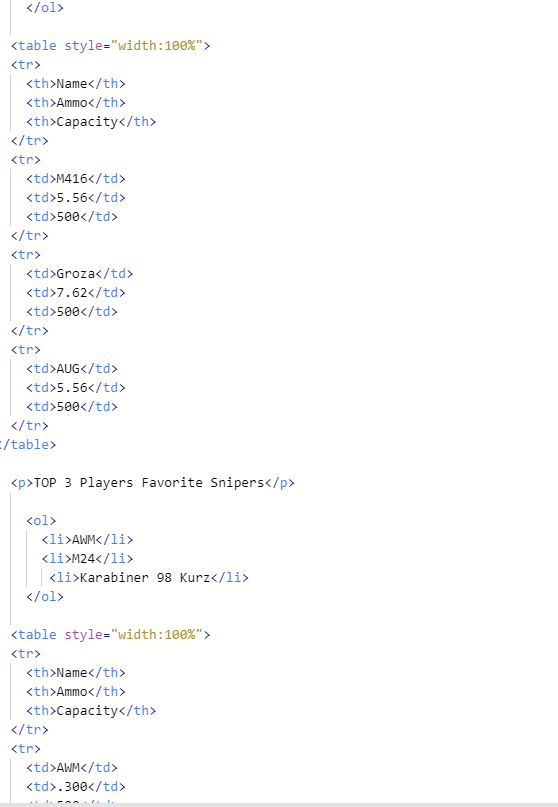
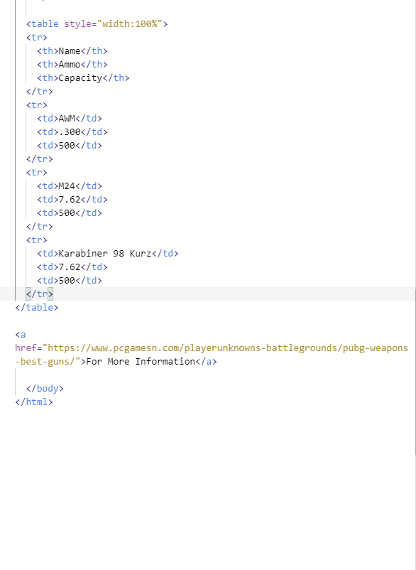

The very first time I play with HTML, CSS and js, I made this little web page to list the favorite weapon that player like to use in the PUBG game. This web page list out some category of weapon, it has rifles and snipers. Also, the list include the top three most popular rifles and snipers. In the top three list, it mark down the ammo type and the capacity for each weapon. In addition, at the bottom of this web page, it provide a link leads you to another web page that has more detail about all weapons.

  
  
  
  

